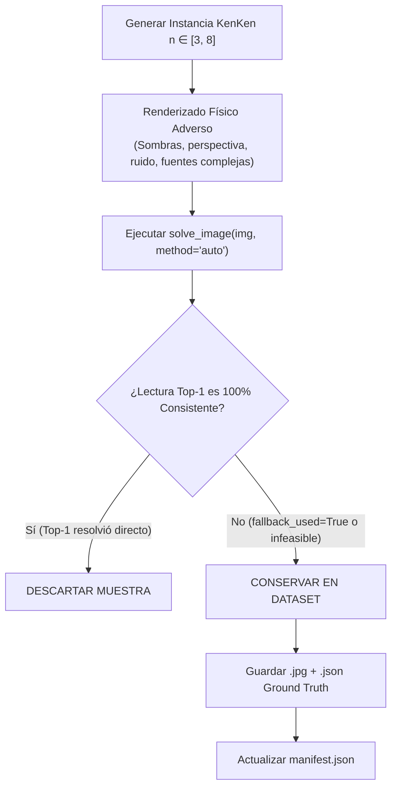

# Dataset de Desafío y Estrés (`dataset/challenge_stress`)

## 1. Motivación y Objetivo

El pipeline de percepción y el modelo `GlyphCNN` alcanzan un **99.51%** de exactitud por glifo en el dataset sintético estándar, resolviendo el 82.0% de los tableros en **Top-1 directo** sin requerir correcciones. En la interfaz interactiva, esto produce el mensaje:
> `⚡ 100% Consistente: Todas las jaulas leídas en top-1 formaron directamente un Cuadrado Latino válido sin requerir modificaciones.`

Para investigar los límites del modelo, entrenar futuros ciclos de fine-tuning enfocados en casos extremos y poner a prueba la **Inferencia Conjunta Neuro-Simbólica (Variante C / MAP)**, se construyó el conjunto especializado **`dataset/challenge_stress`**.

### Regla Estricta de Filtrado:
Ninguna muestra incluida en este dataset tiene lectura directa Top-1 100% consistente. Todas las imágenes presentan al menos una etiqueta ambigua, conflictiva o degradada que imposibilita la resolución directa en Variante A, activando el mecanismo de corrección conjunta o desafiando la capacidad discriminativa del OCR.

---

## 2. Generación y Metodología (`kenken/make_challenge_dataset.py`)

El script de generación aplica el siguiente flujo de selección:



### Parámetros de Degradación Física Aplicados:
1. **Fuentes tipográficas con trazos compactos y serifas:** `tahoma.ttf`, `times.ttf`, `georgia.ttf`, `comic.ttf`, `cour.ttf`.
2. **Iluminación no uniforme y sombras locales:** Factores de sombra de $40\%$ a $70\%$ cubriendo zonas de texto (`shadow_p = 0.90`).
3. **Perspectiva y rotación residual:** Variaciones angulares de hasta $\pm 25^\circ$ con distorsión proyectiva.
4. **Artefactos de compresión y ruido:** Calidad JPEG degradada ($q \in [15, 50]$) y ruido gaussiano de sensor ($\sigma \in [6, 18]$).

---

## 3. Métricas Cuantitativas del Dataset

Se evaluaron las 50 muestras generadas con el comando:
```powershell
python -m kenken.evaluate --ocr dataset/challenge_stress results/ocr_challenge_stress.csv
```

### Resultados Globales:

| Métrica | Benchmark Normal | Benchmark Difícil | **Challenge Stress Dataset** |
|---|:---:|:---:|:---:|
| **Imágenes evaluadas** | 300 | 150 | **50** |
| **Glifos analizados** | 12,266 | 4,859 | **1,778** |
| **Exactitud de segmentación** | 96.5% | 75.8% | **80.5%** |
| **Jaulas Top-1** | 97.5% | 74.3% | **83.8%** |
| **Jaulas Top-$k$** | 99.2% | 84.4% | **93.9%** |
| **Tableros Top-1 Directos (`inst_ok`)** | 82.0% | 32.0% | **4.0%** (Solo 2 de 50) |
| **Tableros Resueltos con Fallback MAP (`inst_topk`)** | 90.3% | 44.7% | **52.0%** (26 de 50) |
| **Tasa de Activación de Corrección Conjunta** | 9.8% | 39.6% | **96.0%** |
| **Tiempo medio por imagen** | 0.261s | 0.365s | **0.387s** |

### Desglose por Dimensión de Tablero:

| Dimensión $n$ | Cantidad de Tableros | Éxito Top-1 Directo | Éxito con Inferencia Conjunta (MAP) |
|:---:|:---:|:---:|:---:|
| **$n=3$** | 1 | **0.0%** | **100.0%** |
| **$n=4$** | 2 | **0.0%** | **100.0%** |
| **$n=5$** | 9 | **11.1%** | **55.6%** |
| **$n=6$** | 13 | **7.7%** | **53.8%** |
| **$n=7$** | 12 | **0.0%** | **50.0%** |
| **$n=8$** | 13 | **0.0%** | **38.5%** |

---

## 4. Integración en el Prototipo Interactivo Gradio

Para permitir la comprobación interactiva en vivo sin depender de fotos sintéticas externas, se integraron muestras de este dataset en la galería de ejemplos del prototipo:

- `prototipo_interactivo/sample_images/kenken_4x4_desafio_map.jpg`
- `prototipo_interactivo/sample_images/kenken_5x5_desafio_map.jpg`
- `prototipo_interactivo/sample_images/kenken_3x3_desafio_map.jpg`

Al hacer clic sobre cualquiera de ellas en la interfaz web de Gradio (`python app.py`), el sistema exhibe el diagnóstico de inferencia conjunta:

```text
🧩 KenKen 4×4 Resuelto Exitosamente
Inferencia Conjunta (MAP): ✅ Activada (8 jaula(s) modificada(s))

🔍 Diagnóstico de Correcciones (MAP):
🟢 Confianza Alta: Se corrigieron lecturas ambiguas sobre jaulas en conflicto.
- Jaula 0 [(0,0), (0,1)]: Top-1 visual '4/' ➔ Corregido a '2/'
...
```

---

## 5. Uso del Dataset para Futuro Fine-Tuning

Las muestras generadas en `dataset/challenge_stress/` pueden alimentar ciclos futuros de Hard Example Mining de la siguiente manera:

```powershell
# Evaluar comportamiento de cualquier checkpoint sobre este dataset de estrés:
python -m kenken.evaluate --ocr dataset/challenge_stress results/eval_stress.csv --model models/ocr_cnn_finetuned.pt

# Resolver una muestra individual inspeccionando el fallback:
python -m kenken --image dataset/challenge_stress/stress_00001.jpg
```
