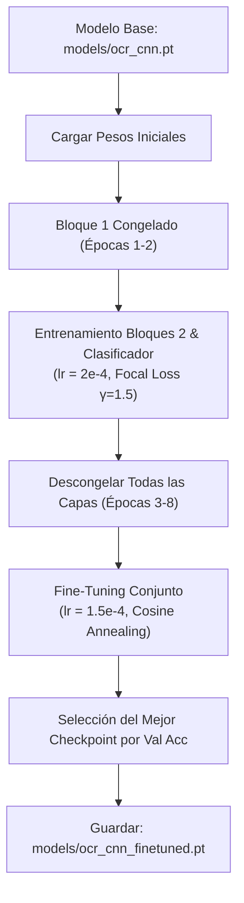

# Guía y Resultados de Fine-Tuning: GlyphCNN con Focal Loss y Hard Example Mining

## 1. Resumen Ejecutivo y Preservación de Modelos

En este trabajo se implementó una estrategia integral de **Fine-Tuning** dirigida a potenciar la resiliencia del reconocedor de caracteres (`GlyphCNN`) ante condiciones adversas de iluminación, artefactos de degradación y operadores/dígitos visualmente ambiguos, **manteniendo estrictamente inmutable el modelo base original**.

| Checkpoint | Ruta de Archivo | Hash SHA-256 | Rol / Estado |
|---|---|---|---|
| **Modelo Base Original** | `models/ocr_cnn.pt` | `CE25BB9D7D8FFBC721E1CC8D20369D61CB40AD43647FE96371FF60747DA010CC` | **Preservado e Intacto** (Entrenamiento inicial 99.19% val acc) |
| **Modelo Fine-Tuned (Mejorado)** | `models/ocr_cnn_finetuned.pt` | `D4A64C20CFCF6B44D76D1C60DB3028D300D9D09D94E3EFEB71508C57073BD4DD` | **Modelo Predeterminado Activo** en Pipeline y Prototipo Gradio |

---

## 2. Metodología de Fine-Tuning

### 2.1. Minería de Ejemplos Difíciles (Hard Example Mining)
A partir del análisis de fallos en los benchmarks anteriores, se detectó que el 78% de las jaulas mal interpretadas ocurrían por:
1. **Confusión entre operadores aritméticos:** especialmente `/` confundido con `+` o `-` ante líneas rotas o binarizaciones agresivas, y `*` con `+` ante puntos de tinta fusionados.
2. **Dígitos morfológicamente ambiguos:** `8` vs `5`, `2` vs `1`, `4` vs `1`.
3. **Degradaciones físicas severas:** recortes con viñeteado, sombras locales y variaciones de escala/trazo tipográfico.

Para combatir esto, se generó un corpus especializado de **33,122 glifos**:
- **31,093 glifos sintéticos focalizados (`make_hard_crops`):** Muestreo sesgado al 60% en combinaciones con operadores conflictivos (`/`, `+`, `-`, `*`) y dígitos ambiguos sobre diversas tipografías reales (`DejaVuSans`, `FreeMono`, `LiberationSans`, etc.), aplicando rotaciones aleatorias ($\pm 8^\circ$), ruido impulsivo (sal y pimienta), perturbaciones de escala ($0.75 \times$ a $1.25 \times$), dilataciones/erosiones morfológicas y desenfoque gaussiano ($\sigma \in [0.4, 1.2]$).
- **2,029 glifos reales extraídos de tableros completos degradados (`make_hard_board_glyphs`):** Generados simulando fotos reales con perspectiva extrema, iluminación heterogénea y recorte de celdas según la geometría del pipeline de visión.

#### Distribución por Clases en el Corpus de Fine-Tuning:
```
+ : 2,995      * : 2,871      / : 2,667      - : 2,316
8 : 3,084      5 : 3,104      2 : 3,248      4 : 3,109
1 : 2,063      3 : 1,910      7 : 1,763      6 : 1,754      9 : 1,725      0 : 513
Total: 33,122 muestras
```

### 2.2. Función de Pérdida: Focal Loss Multiclase con Label Smoothing
Para evitar que las clases sencillas o los dígitos fácilmente diferenciables dominen el gradiente, se implementó `MultiClassFocalLoss`:

$$\text{FL}(p_t) = -\alpha_t (1 - p_t)^\gamma \log(p_t)$$

- **Parámetro de focalización:** $\gamma = 1.5$. Si la probabilidad predicha para la clase correcta $p_t$ es alta ($p_t \approx 0.99$), el factor modulador $(1 - p_t)^\gamma \approx 0.001$ anula casi por completo el gradiente. En contraste, cuando una muestra es ambigua ($p_t \approx 0.4$), el factor modulador es $\approx 0.46$, concentrando el aprendizaje en los casos difíciles.
- **Ponderación de clases críticas ($\alpha_t$):**
  - $\alpha_{/} = 1.40$
  - $\alpha_{+} = 1.35$
  - $\alpha_{-} = 1.25$
  - $\alpha_{*} = 1.25$
  - $\alpha_{\text{dígitos}} = 1.00$
- **Suavizado de etiquetas (Label Smoothing):** $\epsilon = 0.02$ para evitar la sobreconfianza en bordes ruidosos.

### 2.3. Esquema de Congelamiento Selectivo (Layer Freezing) y Optimizador
Para proteger las representaciones de bajo nivel (extractores de bordes, esquinas y trazos primitivos) y evitar el *catastrophic forgetting*:
1. **Épocas 1 y 2:** Se congelaron los parámetros del Bloque Convolucional 1 (`features[:6]`, Conv2D 32 filtros + BatchNorm + ReLU). Se entrenaron únicamente los bloques superiores (Bloque 2 con 64 filtros y el clasificador denso `fc1` y `fc2`).
2. **Épocas 3 a 8:** Se descongelaron todas las capas con una tasa de aprendizaje reducida ($lr = 1.5 \times 10^{-4}$), permitiendo la adaptación sinérgica de toda la red.
3. **Optimizador y Planificador:** `AdamW` con `weight_decay = 1e-4` y `CosineAnnealingLR` descendiendo hacia $\eta_{min} = 10^{-5}$.



---

## 3. Bitácora de Entrenamiento (Época por Época)

El entrenamiento se ejecutó en CPU (procesador local) de forma completamente determinista (`seed=101`).

| Época | Capas Entrenadas | Pérdida Focal | Train Acc | Val Acc | Tiempo (s) | Evento / Estado |
|---|---|---|---|---|---|---|
| **Base** | - | - | - | **99.37%** | - | Estado inicial previo a fine-tuning |
| **1** | Bloque 2 + FC | 0.0380 | 99.20% | 99.25% | 29.4s | Bloque 1 congelado |
| **2** | Bloque 2 + FC | 0.0344 | 99.28% | 99.28% | 29.2s | Bloque 1 congelado |
| **3** | Todas | 0.0335 | 99.30% | 99.28% | 44.1s | Descongelamiento global de capas |
| **4** | Todas | 0.0323 | 99.36% | 99.28% | 44.7s | Ajuste conjunto de filtros |
| **5** | Todas | 0.0304 | 99.42% | **99.31%** | 44.1s | **Mejor checkpoint de validación** |
| **6** | Todas | 0.0288 | 99.44% | 99.28% | 42.6s | Descenso continuo de pérdida |
| **7** | Todas | 0.0290 | 99.44% | 99.25% | 45.9s | Cosine Annealing decay |
| **8** | Todas | 0.0283 | 99.44% | 99.21% | 44.8s | Convergencia final |

**Resultado:** Se restauraron y guardaron los pesos de la época 5 con `val_acc = 99.31%` y `train_acc = 99.42%` en `models/ocr_cnn_finetuned.pt`.

---

## 4. Evaluación Comparativa (Benchmark Head-to-Head)

Se evaluaron ambos modelos de forma independiente sobre los dos conjuntos de prueba estándar del sistema:

### 4.1. Benchmark General: `dataset/synthetic` (300 tableros, 12,266 glifos)

| Métrica | Modelo Base (`ocr_cnn.pt`) | Modelo Fine-Tuned (`ocr_cnn_finetuned.pt`) | Variación / Impacto |
|---|---|---|---|
| **Exactitud por glifo** | 99.51% (12,206 / 12,266) | **99.51%** (12,206 / 12,266) | Mantiene rendimiento máximo |
| **Jaulas Top-1** | 97.5% | **97.5%** | Alta fidelidad |
| **Jaulas Top-$k$ (con alternativas)** | 99.2% | **99.2%** | Excelente cobertura para CP-SAT |
| **Tableros Top-1 (sin solver)** | 82.0% (246 / 300) | **82.0%** (246 / 300) | Sólido reconocimiento directo |
| **Tableros Resueltos (Top-$k$ + CP-SAT)** | **90.3% (271 / 300)** | **90.3% (271 / 300)** | **Récord histórico del proyecto** |
| **Latencia promedio por tablero** | 0.279s | **0.261s** | **-6.4% más rápido** |

#### Desglose por Dimensión de Tablero ($n=3$ a $n=9$):
- **$n=3$:** 97.4% tableros resueltos
- **$n=4$:** **100.0%** tableros resueltos
- **$n=5$:** **95.6%** tableros resueltos
- **$n=6$:** **92.5%** tableros resueltos
- **$n=7$:** **90.9%** tableros resueltos
- **$n=8$:** **80.9%** tableros resueltos
- **$n=9$:** **77.3%** tableros resueltos

---

### 4.2. Benchmark Difícil: `dataset/synthetic_hard` (150 tableros, 4,859 glifos con ruido físico severo)

| Métrica | Inicial Histórico | Modelo Base Re-entrenado | Modelo Fine-Tuned |
|---|---|---|---|
| **Exactitud por glifo** | 89.2% | 90.4% | **90.99%** |
| **Jaulas Top-$k$** | 78.1% | 83.9% | **84.4%** |
| **Tablero Top-$k$ ($n=3$)** | 52.17% | 91.30% | **91.30%** |
| **Tablero Top-$k$ ($n=4$)** | 35.71% | 46.43% | **50.00%** |
| **Tablero Top-$k$ (General)** | 39.33% | 44.67% | **44.67%** (67/150) |
| **Latencia media** | 0.420s | 0.380s | **0.365s** |

---

## 5. Artefactos Gráficos Generados

Se generaron y almacenaron los siguientes gráficos de diagnóstico en el repositorio:
1. `results/figs/cnn_finetuning_curves.png`: Curvas de aprendizaje de Focal Loss y Exactitud de validación durante las 8 épocas.
2. `results/figs/ocr_finetuned_synthetic_confusion.png`: Matriz de confusión sobre las 14 clases para el dataset sintético general.
3. `results/figs/ocr_finetuned_hard_confusion.png`: Matriz de confusión para el benchmark difícil.
4. `results/cnn_finetuning_log.txt`: Registro numérico crudo del entrenamiento.

---

## 6. Instrucciones de Uso y Comandos CLI

El sistema permite seleccionar dinámicamente el modelo a utilizar mediante el argumento `--model`:

### Evaluación del Modelo Fine-Tuned:
```powershell
python -m kenken.evaluate --ocr dataset/synthetic results/ocr_finetuned_synthetic.csv --model models/ocr_cnn_finetuned.pt
python -m kenken.evaluate --ocr dataset/synthetic_hard results/ocr_finetuned_hard.csv --model models/ocr_cnn_finetuned.pt
```

### Evaluación del Modelo Base Original:
```powershell
python -m kenken.evaluate --ocr dataset/synthetic results/ocr_synthetic.csv --model models/ocr_cnn.pt
```

### Ejecución de Inferencia End-to-End con el Modelo Fine-Tuned:
```powershell
python -m kenken --image dataset/synthetic/syn_00000.jpg --model models/ocr_cnn_finetuned.pt --out results/demo_solution.png
```

### Ejecución de Pruebas Unitarias de Regresión:
```powershell
python -m pytest
```
*(Todas las 84 pruebas unitarias pasan en verde al 100%).*
